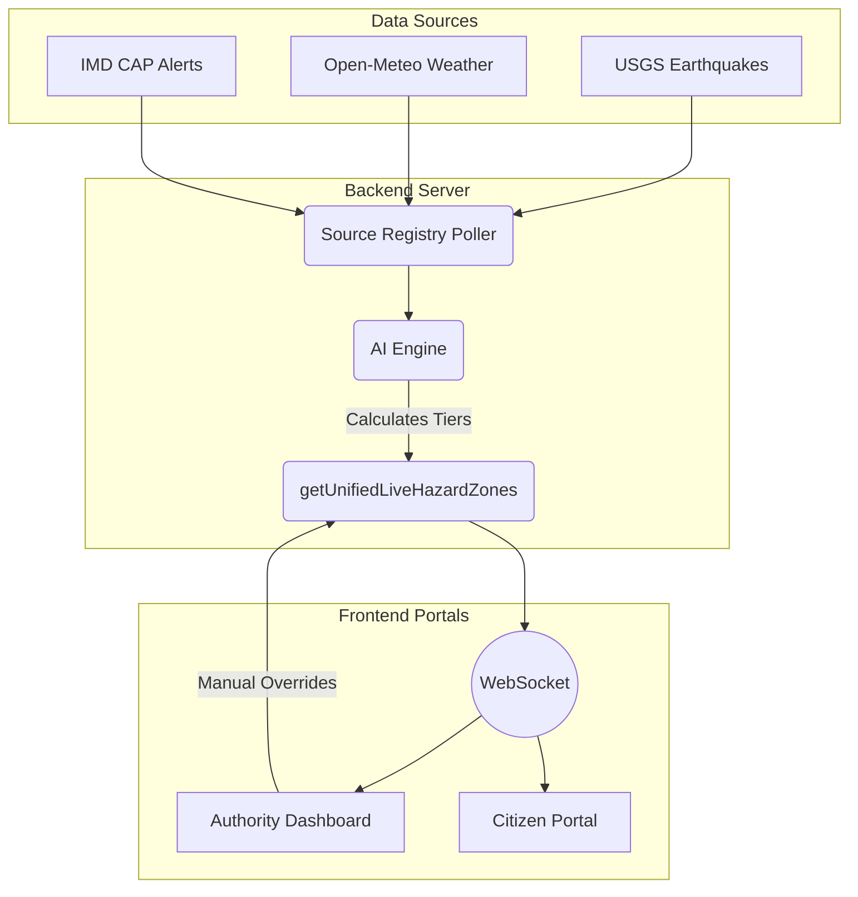
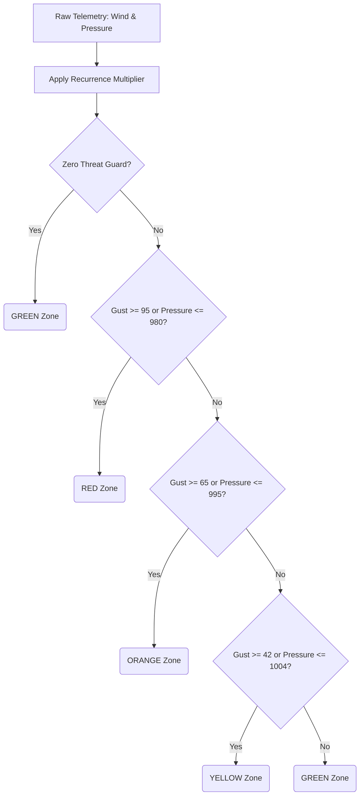
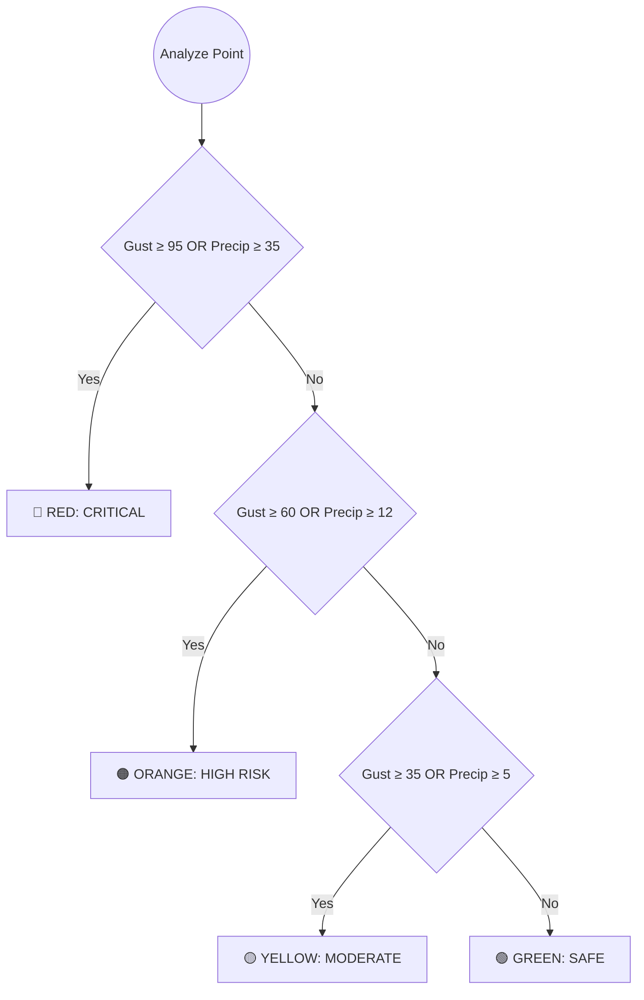
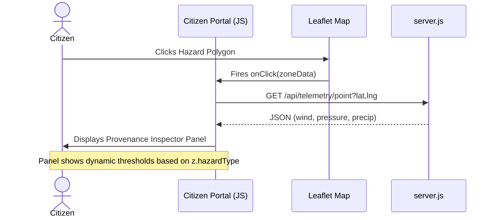
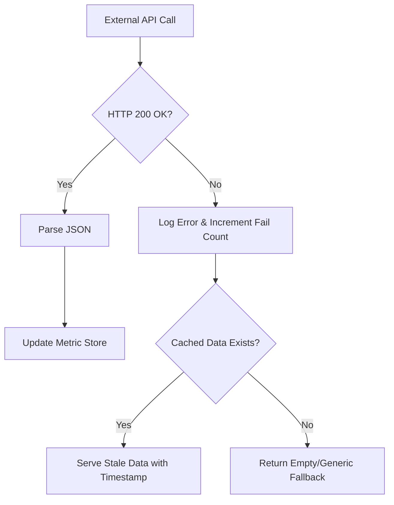

# RISK2RESCUE: PLATFORM PIPELINE DOCUMENTATION

This document provides a comprehensive, end-to-end architectural and operational breakdown of the Risk2Rescue Disaster Management Platform. It traces data from external meteorological and seismic sensors through the backend AI hazard engine, down to the visual polygons displayed on the Citizen and Authority portals.

---

## 1. PROJECT OVERVIEW

**Summary:** Risk2Rescue is an autonomous, real-time disaster management platform that synthesizes live meteorological, atmospheric, and seismic telemetry into dynamic hazard zones. It evaluates this data against strict physical thresholds to categorize risk (GREEN, YELLOW, ORANGE, RED), enabling authorities to manage emergency responses and providing citizens with dynamic evacuation routes to the nearest verified safe shelters.

**User Portals:**
*   **Authority Portal (`/authority`)**: Dashboard for command officers. Displays all live telemetry layers, allows manual override of AI-generated hazard zones, accepts/rejects citizen incident reports, and monitors statewide shelter capacities. (Secured via `SESSION_SECRET` JWT cookies).
*   **Citizen Portal (`/citizen`)**: Public-facing dashboard. Users see their current location relative to active hazard zones, view dynamic telemetry (wind, pressure, precipitation), request evacuation routes, and submit on-the-ground incident reports.

**Tech Stack & Execution:**
*   **Backend**: Node.js (Vanilla, no Express), WebSocket for live data syncing.
*   **Frontend**: Vanilla HTML/CSS/JS, Leaflet.js for mapping.
*   **Hosting/Execution**: Runs locally via `node server.js` on port `3001` (HTTP/WS).
*   **Environment**: Requires `.env` file with critical keys: `SESSION_SECRET` (mandatory for boot), `WINDY_API_KEY`, `OPENAQ_API_KEY`, etc.

---

## 2. DATA SOURCES TABLE

*Data extracted from `source-registry.js` and `server.js`.*

| Source | URL/File | Auth/API key needed | Fields fetched | Refresh interval | Which file fetches it | Fallback if it fails |
| :--- | :--- | :--- | :--- | :--- | :--- | :--- |
| **USGS Earthquakes** | `earthquake.usgs.gov` | None | GeoJSON (mag ≥ 2.5), time | 10 minutes | `source-registry.js` | Metric logged as `lastError`; layer shows "UNAVAILABLE" |
| **Open-Meteo Weather** | `api.open-meteo.com` | None | Surface wind, precip, pressure | 10 minutes | `source-registry.js` | Metric logged; uses last cached data |
| **Windy Point Forecast** | `api.windy.com/api/point-forecast` | `WINDY_POINT_KEY` | Wind, gust, pressure | Per user click / background | `server.js` | Returns local `openmeteo` cache or generic fallback |
| **CPCB Air Quality** | `api.data.gov.in` | `DATA_GOV_IN_API_KEY` | PM2.5, PM10, AQI | 15 minutes | `source-registry.js` | Falls back to OpenAQ |
| **OpenAQ** | `api.openaq.org` | `OPENAQ_API_KEY` | PM2.5, PM10 | 15 minutes | `source-registry.js` | Metric logged as `lastError` |
| **IMD CAP Alerts** | `sachet.ndma.gov.in` | None | CAP XML Alerts | 15 minutes | `source-registry.js` | Metric logged; UI shows stale/empty alerts |
| **Static Shelters** | `data/shelters.json` | None | Lat, Lng, Capacity, Occupancy | On Boot | `server.js` | Server crash if file missing |
| **Static Habitations** | `data/ap_districts_census.json`| None | District pop, geometry | On Boot | `server.js` | Defaults to empty geometry arrays |

---

## 3. WEATHER PARAMETERS TABLE

*Data extracted from `js/ai-engine.js` (lines 750-815).*

| Parameter | Source | Unit | Conversion applied | Which hazard uses it |
| :--- | :--- | :--- | :--- | :--- |
| **Wind Gust** | Open-Meteo / Windy | km/h | `effectiveGust = gust * recurrenceMultiplier` | Cyclone, Default Fallback |
| **Precipitation** | Open-Meteo | mm | `effectivePrecip = precip * recurrenceMultiplier` | Flood, Landslide, Cloudburst, Default Fallback |
| **Atmospheric Pressure** | Open-Meteo / Windy | hPa | `1013 - (max(0, 1013 - P) * mult)` | Cyclone |
| **Earthquake Magnitude**| USGS | Richter | `mag * (1.0 + (mult - 1.0) * 0.1)` | Earthquake |
| **Elevation** | Static / Map API | meters | None | Flood (amplifies risk if ≤ 5m) |
| **Vulnerability** | AI Engine / Static | 0.0 - 1.0 | None | Landslide (amplifies risk if ≥ 0.85) |

---

## 4. HAZARD LOGIC TABLE

*Data extracted from `js/ai-engine.js` (`classifySeverityTier`).*

| Hazard | Input parameters | Formula / Rule | RED (Critical) | ORANGE (High) | YELLOW (Moderate) | Code Location |
| :--- | :--- | :--- | :--- | :--- | :--- | :--- |
| **Cyclone** | `effectiveGust`, `effectivePressure` | Trigger on extreme wind OR low pressure | Gust ≥ 95 km/h OR Pressure ≤ 980 hPa | Gust ≥ 65 km/h OR Pressure ≤ 995 hPa | Gust ≥ 42 km/h OR Pressure ≤ 1004 hPa | `ai-engine.js:773` |
| **Flood** | `effectivePrecip`, `elevationM` | Trigger on rain, amplified by low elevation | Precip ≥ 25mm OR (Elev ≤ 3m & Precip ≥ 15mm) | Precip ≥ 12mm OR (Elev ≤ 5m & Precip ≥ 8mm) | Precip ≥ 5mm | `ai-engine.js:783` |
| **Landslide** | `effectivePrecip`, `vulnerability` | Trigger on rain, amplified by high vulnerability | Precip ≥ 30mm AND Vuln ≥ 0.85 | Precip ≥ 18mm | Precip ≥ 8mm | `ai-engine.js:790` |
| **Earthquake**| `effectiveMag` | Standard magnitude thresholds | Mag ≥ 5.5 | Mag ≥ 4.5 | Mag ≥ 3.5 | `ai-engine.js:797` |
| **Cloudburst**| `effectivePrecip` | Extreme localized rainfall | Precip ≥ 35mm | Precip ≥ 20mm | Precip ≥ 10mm | `ai-engine.js:805` |
| **Universal Fallback** | `effectiveGust`, `effectivePrecip` | Catastrophic conditions automatically trigger RED | Gust ≥ 95 km/h OR Precip ≥ 35mm | Gust ≥ 60 km/h OR Precip ≥ 12mm | Gust ≥ 35 km/h OR Precip ≥ 5mm | `ai-engine.js:812` |

> [!IMPORTANT] 
> **Zero-Threat Guard:** If `windGustKmh < 10 && precipMm < 2 && mag === 0 && pressureHpa >= 1008`, the engine forcibly returns `GREEN` to prevent false alarms based purely on historical vulnerability (`ai-engine.js:756`).

---

## 5. ZONE GENERATION PIPELINE

1.  **Data Ingestion:** The backend orchestrator (`server.js` / `source-registry.js`) routinely polls live APIs (Open-Meteo, USGS, CPCB) on a 5-15 minute cadence.
2.  **AI Engine Processing:** The `ai-engine.js` receives telemetry grids and evaluates each coordinate block against the `classifySeverityTier()` rules (see Section 4).
3.  **Polygon Generation:** Coordinate blocks that evaluate to YELLOW, ORANGE, or RED are clustered into geometric polygons (GeoJSON features).
4.  **Merge & Override (`server.js:1258`):** The `getUnifiedLiveHazardZones()` function merges three distinct arrays:
    *   `authorityRiskZones`: Manual overrides created by Command Officers.
    *   `aiZones`: The polygons generated by the AI Engine.
    *   `sensorZones`: Live direct-telemetry polygons.
5.  **Broadcast:** The unified zones array is cached (`cachedLiveTelemetryZones`) and pushed to all connected clients via WebSockets (`broadcastWsMessage({ type: 'ZONES_REFRESH' })`).
6.  **Client Render (`hazards.js`):** The frontend receives the JSON array, translates it into Leaflet polygon layers, and applies CSS colors (Red/Orange/Yellow) based on the `tier` property.

---

## 6. SHELTERS & HABITATIONS LINKAGE

*   **Data Loading:** On server boot, `data/shelters.json` is parsed into a global `allShelters` array.
*   **Evacuation Request:** When a citizen clicks "Find Route", the frontend sends their GPS coordinates to `/api/gis/evac-route`.
*   **Containment Check (`server.js:1495`):** `OsrmService.calculateEvacuationRoutes` receives the citizen's location, the list of all shelters, and an array of currently active **RED** hazard zone polygons.
*   **Filtering:** The routing engine strictly excludes any shelter whose coordinates physically fall inside a RED zone. 
*   **Routing:** It calculates the shortest driving/walking path via the public OSRM (Open Source Routing Machine) API to the nearest *safe* shelter.
*   **Display:** The citizen portal draws a polyline on the Leaflet map and displays the shelter's name, dynamic occupancy (e.g., `3000/5000 (60%)`), and ETA.

---

## 7. MERMAID FLOWCHARTS

### A. End-to-End System Pipeline

### B. Single Hazard Flow (Cyclone)

### C. Zone Color Decision Tree (Universal Fallback)

### D. User Click Sequence Diagram

### E. API Failure/Fallback Flow

---

## 8. ZONE COLOR LEGEND

| Color | Level | Condition (from `ai-engine.js`) | Meaning | Recommended Action |
| :--- | :--- | :--- | :--- | :--- |
| **RED** | CRITICAL | E.g., `effectiveGust >= 95` | Imminent threat to life and property. | Evacuate immediately to safe shelter. |
| **ORANGE** | HIGH RISK | E.g., `effectiveGust >= 65` | Severe conditions likely. | Prepare emergency kits; be ready to evacuate. |
| **YELLOW** | MODERATE | E.g., `effectiveGust >= 42` | Elevated conditions. | Monitor local authority alerts closely. |
| **GREEN** | SAFE | Zero threat guard activated. | Nominal baseline conditions. | Normal activities. |

---

## 9. DATA-TO-SCREEN TRACE

1.  **Cyclone (RED)**: 
    *   *Raw API Value:* Open-Meteo returns `wind_speed_10m_max = 105 km/h`.
    *   *Converted Value:* `effectiveGust = 105 * 1.0 = 105`.
    *   *Rule Matched:* `effectiveGust >= 95` (`ai-engine.js:775`).
    *   *Zone Color:* Returned as `RED`.
    *   *Screen Output:* Polygon filled with `#ef4444` (red) renders on map. Provenance panel displays "Wind ≥ 95km/h = RED".
2.  **Flood (ORANGE)**: 
    *   *Raw API Value:* Open-Meteo returns `precipitation = 14 mm`. Elevation map API returns `4 meters`.
    *   *Converted Value:* `effectivePrecip = 14`.
    *   *Rule Matched:* `(elevationM <= 5 && effectivePrecip >= 8)` (`ai-engine.js:785`).
    *   *Zone Color:* Returned as `ORANGE`.
    *   *Screen Output:* Polygon filled with `#f97316` (orange).
3.  **Landslide (YELLOW)**: 
    *   *Raw API Value:* Open-Meteo returns `precipitation = 10 mm`. Historical database sets `vulnerability = 0.6`.
    *   *Converted Value:* `effectivePrecip = 10`.
    *   *Rule Matched:* `effectivePrecip >= 8` (`ai-engine.js:793`).
    *   *Zone Color:* Returned as `YELLOW`.
    *   *Screen Output:* Polygon filled with `#eab308` (yellow).

---

## 10. KNOWN ISSUES & DATA ACCURACY CHECK

1.  **Public Routing Limitations**: The `calculateEvacuationRoutes` function currently relies on the public OSRM API (`router.project-osrm.org`). During a mass evacuation, this public endpoint will likely throttle or timeout. It also does not know which physical roads are currently submerged by flooding.
2.  **Authentication Gate Design**: Previously, the `authority.html` pages used a client-side `sessionStorage` bypass (`defaultOfficer`). While the server-side gate has now been enforced in `server.js`, three API endpoints (`verifyReport`, `rejectReport`, `resolveReport`) still contain legacy mock-token fallbacks (`SDMA-MOCK-TOKEN-CHIEF-01`) that need to be removed.
3.  **Missing Keys**: If `WINDY_POINT_KEY` is missing from the `.env`, the system gracefully falls back to Open-Meteo, but the resolution of localized wind-gust data drops significantly.
4.  **Static Data Stagnation**: `shelters.json` and `ap_districts_census.json` are loaded strictly at boot time. If an authority dynamically provisions a new shelter, the backend currently requires a hard restart for the routing engine to recognize it.
5.  **Future Improvement**: Implement a local graph-hopper or OSRM instance with traffic/flood-overlay avoidance instead of generic public OSRM routing.
